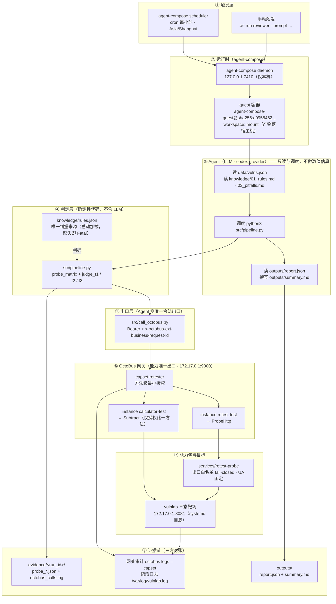

# 架构说明

> 配套 README.md 阅读。第 1 节为分层架构与数据流，第 2 节说明三层职责划分，第 3 节为端口与暴露面。

## 1. 分层架构与数据流

## 2. 三层职责划分

| 层 | 做什么 | 不做什么 | 依据 |
|---|---|---|---|
| Agent（LLM，codex provider） | 读记录与规则、调度管线、解读报告、撰写结论摘要 | 不做任何数值估算，不绕过网关直连目标 | `agent-compose.yml` 的 `system_prompt` |
| OctoBus 网关 | 方法级授权、探针出口白名单、全程审计留痕、能力契约 | 不做安全判定 | `services/retest-probe/config.schema.json`、`bin/probe.js` 的 `assertEgressAllowed` |
| 代码工件 | 取数、比对、比例、哈希；判据装载与校验 | —— | `src/pipeline.py` + `knowledge/rules.json` |

判定逻辑放在 `src/pipeline.py`，没有下沉为 OctoBus 能力包，原因有四条：

1. 考核 5.1.2 要求「可确定性计算的部分（取数、统计、格式校验、评分）应由代码实现」，判定属确定性计算；
2. 下沉只是给一个纯函数多加一次网络往返和一个故障面（同类取舍见 `knowledge/03_pitfalls.md` P-04）；
3. 判定逻辑与 `rules.json` 同版本演进，下沉后「能力包版本」和「判据版本」要分两处维护；
4. 判定的全部输入（探针原始响应、减法差值）都已经过网关并留审计，本地算不减损证据链。

OctoBus 承担的是安全控制，不是安全判定。

## 3. 端口与暴露面

| 组件 | 绑定地址 | 可达范围 |
|---|---|---|
| agent-compose daemon | `127.0.0.1:7410` | 仅本机 |
| OctoBus daemon | `172.17.0.1:9000` | 仅 docker0 内网（guest 容器内经 `http://octobus:9000` 访问） |
| vulnlab 靶场 | `172.17.0.1:8081` | 仅 docker0 内网 |

三个端口均未绑定 `0.0.0.0`，不对公网暴露（`sudo ss -tlnp` 可验）。
